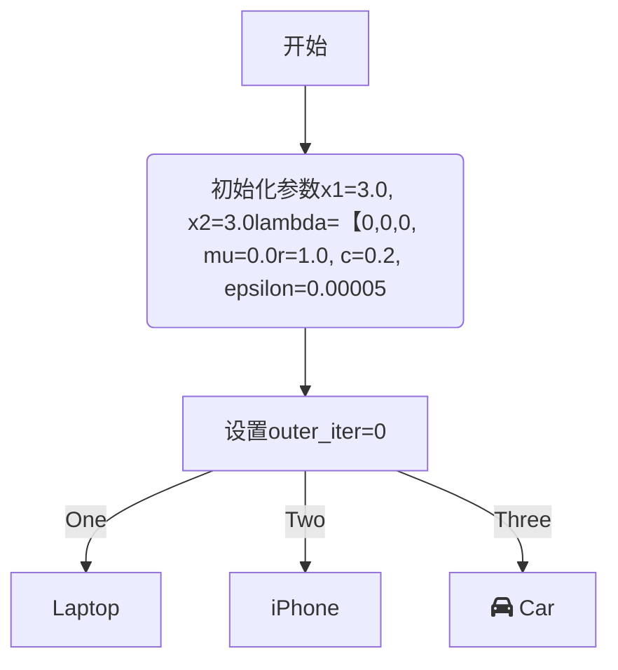

```mermaid
graph TD
    A[开始] --> B(初始化参数x1=3.0, x2=3.0lambda=【0,0,0, mu=0.0r=1.0, c=0.2, epsilon=0.00005)
    B --> C[设置outer_iter=0]
    C -->|One| D[Laptop]
    C -->|Two| E[iPhone]
    C -->|Three| F[fa:fa-car Car]
```